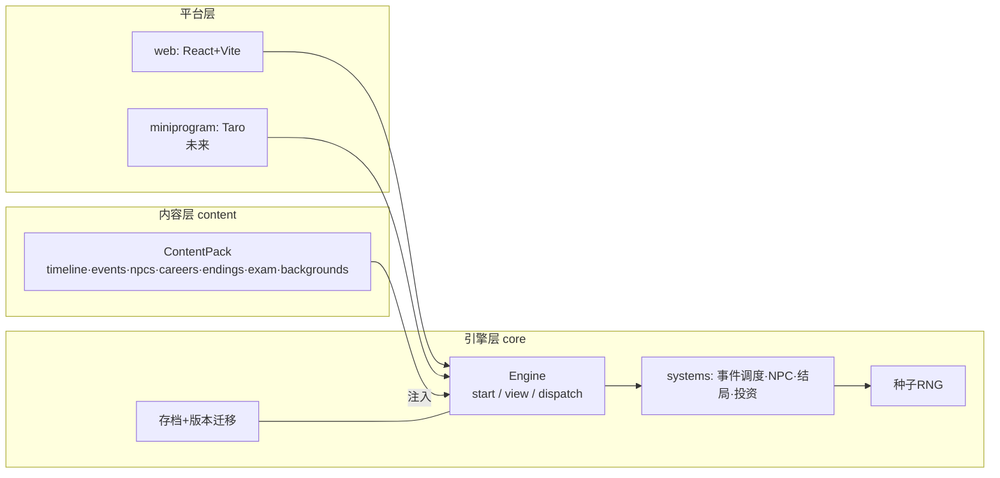

# 《2014:我的十二年》技术架构文档 v1.0

> 配套文档:[GAME_DESIGN.md](./GAME_DESIGN.md)(玩法设计)
> 2026-07-03 定稿。目标:支撑长期内容扩展(年份/事件/NPC/职业线)与多平台移植(Web → 微信小程序)。

---

## 一、设计原则

四条原则,对应你提出的四类扩展需求:

| 原则 | 解决的问题 |
|---|---|
| **P1 内容即数据** | 加事件/NPC/结局 = 新增数据文件,不改引擎代码 |
| **P2 引擎纯函数、零平台依赖** | 移植小程序时引擎和内容 100% 复用,只重写 UI 壳 |
| **P3 时间线配置化** | 把游戏延长到 2030 = 追加配置和事件,引擎里没有写死的 "2026" |
| **P4 一切可校验、可模拟** | 内容多了以后靠工具保平衡:静态校验防死链,批量模拟防数值失控 |

反面教材(来自对 vc-simulator 的逆向):它把 528KB 的逻辑+内容+UI 打成一个不可维护的整体,结局条件写成裸函数导致出现 4 个 `() => false` 的死代码结局且无法被工具检测,也没有存档。本架构逐条规避。

---

## 二、总体架构

```
┌─────────────────────────────────────────────────────┐
│  平台层(每个平台一个薄壳)                            │
│  packages/web (React+Vite)   apps/miniprogram (Taro) │
│  只做:渲染 ViewModel、采集输入、平台服务(存储/分享) │
├─────────────────────────────────────────────────────┤
│  引擎层 packages/core(纯 TypeScript,零运行时依赖)  │
│  状态机 · 回合调度 · 事件抽取 · 数值结算 ·           │
│  NPC 状态机 · 结局判定 · 种子RNG · 存档/迁移         │
├─────────────────────────────────────────────────────┤
│  内容层 packages/content(纯数据 + 少量注册函数)     │
│  时间线 · 事件池 · NPC · 职业线 · 结局 ·             │
│  高考题库 · 家境卡 · 文案                            │
└─────────────────────────────────────────────────────┘
        ▲ 依赖方向:平台层 → 引擎层 → 内容Schema
          (引擎不 import 具体内容,内容以 ContentPack 注入)
```



### 仓库结构(pnpm monorepo)

```
life-simulator-2014/
├── pnpm-workspace.yaml
├── packages/
│   ├── core/                  # @life-sim/core 引擎(禁止 import react/dom/wx)
│   │   └── src/
│   │       ├── types/         # 全部 Schema 类型(内容层的"接口合同")
│   │       ├── engine/        # createEngine: start/view/dispatch
│   │       ├── systems/       # eventScheduler / npc / ending / stats / invest
│   │       ├── dsl/           # 条件与效果 DSL 的求值器
│   │       ├── rng/           # mulberry32 种子随机
│   │       └── save/          # SaveFile 序列化 + 迁移链
│   ├── content/               # @life-sim/content 内容包
│   │   └── src/
│   │       ├── timeline/      # phases.ts(时间线配置)
│   │       ├── events/        # 按池分文件:setup/ college/ career-cs/ career-edu/ npc/ invest/ random/
│   │       ├── npcs/          # 每个 NPC 一个文件
│   │       ├── careers/
│   │       ├── endings/
│   │       ├── exam/          # 题库(按省份档/文理标注)
│   │       ├── backgrounds/   # 家境卡
│   │       └── fns/           # 命名自定义函数注册表(DSL 的逃生舱)
│   ├── web/                   # @life-sim/web React 前端
│   │   └── src/
│   │       ├── screens/       # 每种 ViewModel 一个 Screen 组件
│   │       ├── components/
│   │       └── platform/      # WebStorageAdapter / WebShareService
│   └── tools/                 # @life-sim/tools 校验与模拟 CLI
│       └── src/
│           ├── validate.ts    # 静态校验
│           └── simulate.ts    # 批量自动对局
└── apps/
    └── miniprogram/           # (未来)Taro 小程序,复用 core+content
```

---

## 三、引擎层设计

### 3.1 Redux 式纯函数 API(移植性的根基)

```ts
// 引擎只有三个入口,全部是纯函数,不碰 DOM、不碰存储、不产生副作用
interface Engine {
  start(input: SetupInput, seed?: number): GameState;
  view(state: GameState): ViewModel;                    // 当前该渲染什么
  dispatch(state: GameState, action: PlayerAction): GameState;  // 玩家操作 → 新状态
}

// ViewModel 是判别联合,UI 层只做"模式匹配渲染",不含任何游戏逻辑
type ViewModel =
  | { kind: 'TITLE' }
  | { kind: 'BACKGROUND_DRAW'; card: BackgroundCard }          // 家境抽卡
  | { kind: 'SETUP'; provinces: ProvinceOption[]; tracks: ... } // 省份/文理
  | { kind: 'EXAM'; question: ExamQuestion; index: number; total: number }
  | { kind: 'EXAM_RESULT'; score: number; band: ScoreBand }
  | { kind: 'APPLICATION'; options: ApplicationOption[] }       // 志愿填报
  | { kind: 'BRIEF'; year: number; phaseLabel: string; text: string }  // 时代背景简报
  | { kind: 'EVENT'; event: RenderedEvent; choices: RenderedChoice[] }
  | { kind: 'OUTCOME'; text: string; statDeltas: StatDeltas }
  | { kind: 'SETTLEMENT'; yearSummary: ... }                    // 年度结算
  | { kind: 'ENDING'; ending: RenderedEnding; shareCard: ShareCardData };
```

**为什么这样设计**:小程序移植时,`Engine` 和 `ViewModel` 原样复用,新平台只需为每种 `kind` 写一个渲染组件。游戏逻辑永远只有一份。

### 3.2 GameState(单一状态树)

```ts
interface GameState {
  schemaVersion: number;        // 存档迁移用
  seed: number;
  rngState: number;             // RNG 当前内部状态(存档恢复后随机序列不断裂)
  phaseId: string;              // 当前时间线阶段(来自内容层配置,不写死)
  roundIndex: number;
  date: { year: number; month: number };
  screen: ScreenId;             // UI 状态机指针
  stats: { knowledge: number; money: number; mindset: number; network: number };
  profile: { background: string; province: string; track: '文'|'理';
             examScore: number; university: string; major: string; career: string|null };
  flags: Record<string, boolean|number|string>;   // 通用标记(事件链/剧情开关)
  npcs: Record<NpcId, { favor: number; stage: string; alive: boolean }>;
  scheduled: ScheduledEvent[];  // 延迟事件队列(事件链)
  history: HistoryEntry[];      // 全部已发生事件+选择(结局判定和分享卡都用它)
  endingId: string | null;
}
```

设计要点:
- **flags 是通用扩展点**:任何新剧情机制(比如以后加"房产""子女")先用 flag 承载,常用后再升格为一等字段(配迁移)。
- **rngState 入档**:同一种子 + 同一操作序列 = 完全相同的一局(测试、回放、"挑战同一人生"分享都依赖它)。

### 3.3 回合调度(时间线配置驱动)

引擎的主循环不知道"大学四年""2026 结束"这些概念,它只消费内容层的时间线配置:

```ts
// packages/content/src/timeline/phases.ts
const phases: PhaseConfig[] = [
  { id: 'gaokao',    label: '高考季',  date: { year: 2014, month: 6 },
    flow: ['BACKGROUND_DRAW','SETUP','EXAM','APPLICATION'] },        // 特殊流程阶段
  { id: 'college-1', label: '大一学年', date: { year: 2014, month: 9 },
    rounds: 1, eventSlots: 3, pools: ['college','npc','random'] },
  // ... college-2/3/4
  { id: 'crossroad', label: '大四三岔口', date: { year: 2018, month: 3 },
    flow: ['CROSSROAD_DECISION'] },
  { id: 'work-2018', label: '2018', rounds: 1, eventSlots: 3,
    pools: ['career','npc','invest','random'], mandatoryPools: ['era'] },
  // ... 每年一个,直到:
  { id: 'work-2026', label: '2026', ..., isFinal: true },            // 唯一的"终点"标记
];
```

**把游戏延长到 2030** = ① 把 `isFinal` 挪到 `work-2030`;② 为新年份追加 era 简报和事件;③ 补充/调整结局条件。引擎零改动。

### 3.4 事件调度器(每回合的核心算法)

每个事件回合按固定顺序执行:

1. **到期的延迟事件**(`scheduled` 队列,事件链的后续节)——最高优先
2. **强制时代节点**(`mandatory: true` 且条件满足,如 2021 双减 × 师范线)
3. **NPC 阶段推进事件**(各 NPC 状态机检查是否到达下一剧情节点)
4. **常规池加权抽取**(该阶段 `pools` 里所有 `trigger` 满足的事件,按 `weight` 加权随机,`once` 事件去重,近期出现过的降权防重复)

抽取结果填满该回合的 `eventSlots` 数即停。

---

## 四、内容数据模型(Schema)

### 4.1 条件/效果 DSL(内容可校验性的关键)

**不用裸函数写条件**(vc-simulator 的教训:函数无法被工具分析,死条件无法检测),用可序列化的声明式 DSL:

```ts
type Condition =
  | { stat: 'knowledge'|'money'|'mindset'|'network'; op: '>'|'>='|'<'|'<='|'=='; value: number }
  | { flag: string; equals?: boolean|number|string }
  | { year: { from?: number; to?: number } }
  | { career: string } | { background: string } | { major: string }
  | { npcFavor: NpcId; op: Op; value: number } | { npcStage: NpcId; stage: string }
  | { historyCount: { category: string; outcome?: string; op: Op; value: number } }  // "失败项目≥3个"这类
  | { chance: number }                                   // 概率门
  | { all: Condition[] } | { any: Condition[] } | { not: Condition }
  | { fn: string };   // 逃生舱:引用 content/fns 注册表里的命名函数(<10% 的复杂场景才用)

type Effect =
  | { stats: Partial<StatDeltas> }                       // 数值增减(引擎负责 clamp 0-100)
  | { moneyCost: { rate: number; min?: number; max?: number; roundTo?: number; reason?: string } }
  | { setStat: 'money'|'knowledge'|'mindset'|'network'|'health'; value: number }
  | { setFlag: string; value?: boolean|number|string }
  | { npcFavor: NpcId; delta: number } | { npcStage: NpcId; stage: string }
  | { schedule: { eventId: string; afterRounds: number } }   // 事件链:N回合后触发后续
  | { setCareer: string } | { jumpToPhase: string }          // 复读→回到高考;考研→时间线分支
  | { triggerEnding: string }                                // 提前结局
  | { fn: string; args?: Record<string, unknown> };
```

`fn` 注册表让 DSL 覆盖不了的逻辑仍有出口,但强制**具名、集中、可测试**,不会散落在数据里。

### 4.1.1 金钱扣减 DSL 设计(防固定金额超扣)

问题背景:

- 事件里直接写 `stats: { money: -300000 }` 会在余额不足时被引擎钳到 0,但内容配置表达的是一个玩家实际上付不起的数字。
- 固定扣款对不同家境、职业、投资结果的玩家压力差异过大:穷玩家直接归零,富玩家无感。
- 当前 `money` 同时承担现金、净资产、结局判定资产三种含义,因此大额支出必须显式区分"消费损失"和"资产置换"。

设计新增一个声明式金钱效果,专门处理负向扣减:

```ts
type MoneyCostEffect = {
  moneyCost: {
    /** 按当前 money 的比例扣减,0.25 表示扣 25% */
    rate: number;
    /** 可选:理论扣减下限。实际扣减仍不能超过当前余额 */
    min?: number;
    /** 可选:理论扣减上限 */
    max?: number;
    /** 可选:四舍五入到 100 / 1000 等,避免出现碎金额 */
    roundTo?: number;
    /** 可选:用于工具报表和内容审计 */
    reason?: 'daily' | 'medical' | 'family' | 'investment' | 'scam' | 'house' | 'other';
  };
};
```

引擎计算:

```ts
const raw = state.stats.money * rate;
const bounded = clamp(raw, min ?? 0, max ?? Infinity);
const rounded = roundTo ? Math.round(bounded / roundTo) * roundTo : Math.round(bounded);
const actual = Math.min(state.stats.money, rounded);
state.stats.money -= actual;
deltas.money -= actual;
```

关键约束:

- `actual` 永远不大于当前余额,不会出现"扣减金额大于余额"。
- OUTCOME 页面显示 `actual`,不是配置里的理论值。
- `moneyCost` 只表达负向扣减;工资、奖金、投资收益等正向来源继续使用固定 `stats.money`。
- 如果余额为 0,`moneyCost` 的金钱变化为 0,但同一 outcome 仍可通过心态、健康、人脉等效果表达代价。

资产置换规则:

```ts
type SetStatEffect = { setStat: 'money'; value: 0 };
```

- 买房、全仓投资等"现金换资产"事件不使用大额固定扣减。当前买房使用 `moneyCost` 扣当前余额 50%,再通过 schedule 事件把资产净值折算回 `money`,例如早买房补回高估值,晚买房补回较低估值。
- `setStat` 仍保留给需要精确设置数值的特殊事件,但不是当前买房扣款的主路径。
- 在未来拆分 `cash / assets / debt` 之前,这是一种保持单一 `money` 指标可用的过渡方案。

内容迁移状态:

1. 引擎已实现 `moneyCost` 效果,并保留已有 `setStat`。
2. `validate` 已增加门禁:事件 outcome 中出现 `stats.money < -10000` 会报 error,要求改用 `moneyCost`。万元以内的小额固定支出暂时允许。
3. 已将现有大额固定负扣款迁移到 `moneyCost`;后续新增/调整事件继续按以下口径配置:
   - 日常消费:3%–8%,max 3000–8000
   - 中等消费/预付费:10%–25%,max 20000–50000
   - 投资亏损/诈骗:30%–70%,按风险程度设 max
   - all-in/买房:80%–100%,或 `setStat money=0 + schedule 资产回补`
4. 跑 `pnpm simulate -n 1000 --check` 和四策略 compare,观察金钱分位、提前结局、兜底结局是否偏移。
5. 如果未来需要彻底禁止所有固定负扣款,再把万元以内小额支出的豁免收紧为显式字段或白名单。

### 4.2 事件 Schema

```ts
interface GameEvent {
  id: string;                   // 'ev_cs_2022_layoff'
  pools: string[];              // 属于哪些池:'career-cs' | 'college' | 'npc-roommate' | ...
  title: string;
  text: string;                 // 支持插值:{university} {npc.roommate.name} {stats.money}
  trigger?: Condition;
  weight?: number;              // 默认 1;时代大事件可加权
  once?: boolean;               // 默认 true
  mandatory?: boolean;          // 强制时代节点
  choices: Array<{
    id: string;
    text: string;
    visibleIf?: Condition;      // 隐藏选项(如 人脉>60 才出现"找内推")
    outcomes: Array<{           // 一个选择可有多个概率结果
      weight: number;
      condition?: Condition;    // 结果也可带条件(学识高→成功率高:用两个 outcome+条件实现)
      text: string;
      effects: Effect[];
    }>;
  }>;
}
```

**加一个事件** = 在对应池文件里追加一个对象,跑一遍 `pnpm validate`,完毕。

### 4.3 NPC Schema(状态机)

```ts
interface NpcDef {
  id: string;                   // 'roommate'
  name: string;
  intro: string;
  initialStage: string;
  stages: Record<string, {
    label: string;                       // 'startup_pitch' → 'startup_failed' → 'livestream_comeback'
    advanceWhen?: Condition;             // 满足即推进(通常是年份+flag)
    eventId?: string;                    // 到达该阶段时触发的剧情事件
  }>;
}
```

**加一个 NPC** = 一个 NpcDef 文件 + 它引用的剧情事件(放进 `npc-<id>` 池)。引擎的 NPC 系统是通用的,不认识任何具体角色。

### 4.4 结局 Schema

```ts
interface EndingDef {
  id: string;
  title: string;                // '小镇做题家的胜利'
  text: string;
  category: 'early' | 'final'; // 提前结局(每回合检查) / 终局结算
  priority: number;             // 越小越优先,同 vc-simulator 机制
  condition: Condition;         // 声明式 → simulate 工具能统计每个结局的实际到达率
  shareCard: { tone: 'triumph'|'bitter'|'warm'; tagline: string };
}
```

### 4.5 ContentPack(内容注入引擎的唯一通道)

```ts
interface ContentPack {
  meta: { id: string; version: string };
  timeline: PhaseConfig[];
  events: GameEvent[];
  npcs: NpcDef[];
  careers: CareerDef[];
  endings: EndingDef[];
  examBank: ExamQuestion[];
  backgrounds: BackgroundCard[];
  fns: Record<string, ContentFn>;
}
const engine = createEngine(contentPack);   // 引擎实例化时注入
```

预留能力:未来可支持多个 pack 合并(`mergePacks(base, medicalDLC)`),职业线/剧情包按 DLC 方式增量开发。

---

## 五、存档与版本迁移

```ts
interface SaveFile {
  saveVersion: number;          // 存档结构版本
  contentVersion: string;       // 生成存档时的内容包版本
  createdAt: string;
  seed: number;
  actionLog: PlayerAction[];    // 完整操作日志
  snapshot: GameState;          // 当前状态快照
}
```

**双保险策略**:
- 正常读档用 `snapshot`(快)。
- 内容/引擎升级导致 snapshot 不兼容时,回退到 **seed + actionLog 重放**(引擎纯函数 + RNG 可复现,重放结果确定)。重放同时是最强的回归测试。
- `save/migrations.ts` 维护迁移链:`v1→v2→v3` 逐级升级旧档。

存储通过适配器接口,引擎不知道 localStorage 的存在:

```ts
interface StorageAdapter {
  get(key: string): Promise<string | null>;
  set(key: string, value: string): Promise<void>;
  remove(key: string): Promise<void>;
}
// web:localStorage 包一层;小程序:wx.getStorage / wx.setStorage
```

---

## 六、平台适配(Web 现在,小程序未来)

### 6.1 Web(首发)

React 18 + Vite + TypeScript + Zustand(仅做 UI 状态壳,真状态在 GameState)。
`screens/` 下每种 ViewModel.kind 一个组件;动画用 CSS transition(刻意不引入 framer-motion,见 6.2)。
静态部署 Vercel / Cloudflare Pages。

### 6.2 微信小程序(预留的移植路径)

**方案:Taro 4(React 语法编译到小程序)**,复用比例预估:

| 层 | 复用度 | 说明 |
|---|---|---|
| core 引擎 | **100%** | 纯 TS,直接 npm 引用 |
| content 内容 | **100%** | 纯数据 |
| screens UI | ~60% | Taro 用 React 语法,但组件要换成 View/Text,样式要适配 rpx |
| platform 服务 | 0%(本来就是每平台一份) | WxStorageAdapter、wx.shareAppMessage 分享卡 |

**从现在起就要遵守的小程序约束**(这是把移植成本从"重写"降到"适配"的关键):
1. core/content 不 import 任何浏览器 API(`window`/`document`/`localStorage` 全部禁止,ESLint 规则强制)
2. 不引入重动画/DOM 依赖库(framer-motion、任何操作 DOM 的库)
3. 小程序主包限 2MB:content 包设计上支持按阶段分包懒加载(事件池文件本来就按阶段切分,天然可分包)
4. 分享卡片渲染做成纯数据 → 绘制函数(web 用 DOM/Canvas,小程序用 canvas 2d,输入同一份 `ShareCardData`)

### 6.3 想给内容"加详细程度"时的路径

- 事件文案加长/加插图:`GameEvent` 预留 `image?: string` 字段,UI 有图渲染无图跳过
- 某个选择想要更细的分支:`outcomes` 数组本来就支持任意多条件结果
- 想加新数值维度(比如"健康"独立出来):`stats` 加字段 + 存档迁移 + validate 兜底,DSL 的 `stat` 类型自动覆盖

---

## 七、质量工具链(内容规模化的保险)

### 7.1 静态校验 `pnpm validate`

- Schema 校验(zod):字段类型、必填、数值范围
- 引用完整性:事件引用的 flag/npc/eventId/fn 必须存在;`schedule` 指向的事件必须存在
- ID 全局唯一;每个池至少 N 个事件(防止某阶段抽空)
- **结局可达性静态检查**:condition 恒假(如 `{chance: 0}`、互斥条件)直接报错——从根上杜绝 vc-simulator 的 `() => false` 死结局

### 7.2 批量模拟 `pnpm simulate -n 10000`

引擎纯函数 → 可以让随机 bot(以及"贪心 bot""摆烂 bot"等策略 bot)自动打一万局,输出:

- 结局分布(某结局 0 次到达 = 设计问题,>40% = 太容易)
- 数值曲线分位数(心态是不是普遍在第 8 回合就见底?)
- 事件覆盖率(哪些事件从没被抽到)
- 平均局长(回合数/预估游玩分钟数)

这是纯写死内容游戏做数值平衡的唯一低成本手段,列为**每次内容合并前的必跑项**。

### 7.3 测试

- 引擎单元测试(vitest):调度器、DSL 求值器、结局判定、RNG 复现性
- 黄金存档回归:固定 seed + actionLog,断言最终 GameState 快照不变(引擎重构的安全网)

---

## 八、扩展操作手册(Playbook)

| 我想…… | 要做的事 | 动到的层 |
|---|---|---|
| 加一个事件 | 对应池文件加一个 `GameEvent` → `validate` → `simulate` | 内容 |
| 加一个 NPC | 新 `NpcDef` + 其剧情事件池 | 内容 |
| 加一条职业线 | `CareerDef` + `career-xx` 事件池 + 相关结局 | 内容 |
| 延长到 2030 | timeline 追加 phases + 新年份 era 事件 + 调整 `isFinal` | 内容 |
| 加结局 | `EndingDef` 一条,注意 priority 排位 → simulate 看到达率 | 内容 |
| 加数值维度 | `stats` 加字段 + 存档迁移 + DSL 自动支持 | 引擎(小改)+ 内容 |
| 移植小程序 | Taro 壳 + WxStorageAdapter + screens 适配 | 平台层(新增) |
| 出 DLC 剧情包 | 独立 ContentPack + `mergePacks` | 内容 |

---

## 九、技术选型清单

| 项 | 选择 | 理由 |
|---|---|---|
| 语言 | TypeScript(strict) | Schema 即类型,内容写错编译期报错 |
| 包管理 | pnpm workspace | 三包一仓,依赖方向清晰 |
| 前端 | React 18 + Vite | 生态成熟;Taro 同为 React 语法,移植心智成本最低 |
| UI 状态 | Zustand | 轻;真正的游戏状态在引擎 GameState |
| 校验 | zod | Schema 定义与运行时校验一份代码 |
| 测试 | vitest | 与 Vite 同生态 |
| RNG | mulberry32(自实现,~10 行) | 可种子化、可序列化(vc-simulator 同款,已验证) |
| 部署 | Vercel / Cloudflare Pages | 纯静态,零成本 |

**非目标(明确不做)**:后端/账号系统、运行时 LLM 调用、多语言、移动原生 App。

---

## 十、实施里程碑

| 里程碑 | 内容 | 验收标准 |
|---|---|---|
| M0 骨架 | monorepo + core 引擎跑通 + 最小内容包(3事件1结局)+ simulate CLI | 命令行能自动打完一局 |
| M1 开局 | 抽卡→省份/文理→答题→志愿 全流程 + web UI 壳 | 浏览器里能玩到"大学录取" |
| M2 大学 | 4 学年回合 + NPC 系统(室友/初恋)+ 三岔口 | 能玩到 2018 毕业 |
| M3 社会 | 年度回合 + 计算机/师范双职业线 + 投资线 | 能玩到 2026 |
| M4 终局 | 结局系统 + 分享卡片 + localStorage 存档 | 完整一局 + 可分享 |
| M5 打磨 | 内容填充至 ~125 事件 + simulate 驱动平衡 + 移动端适配 | 结局分布合理,可公开上线 |
