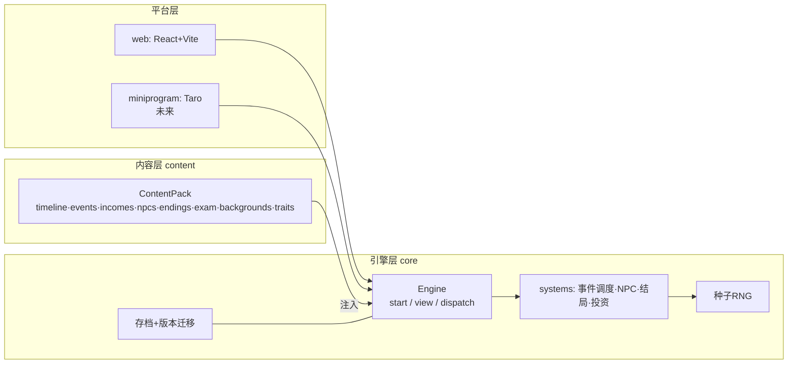
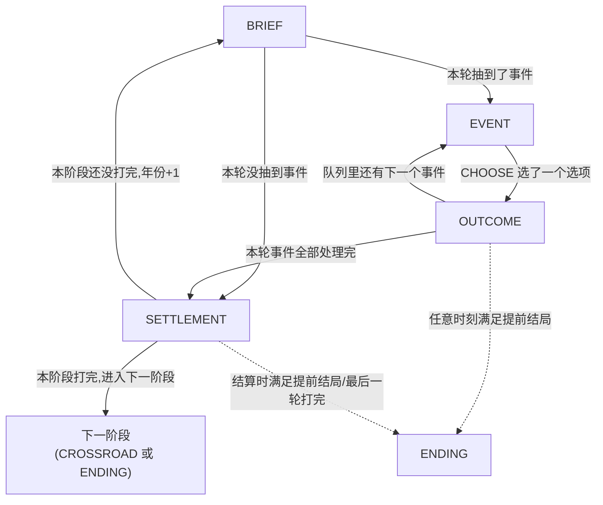
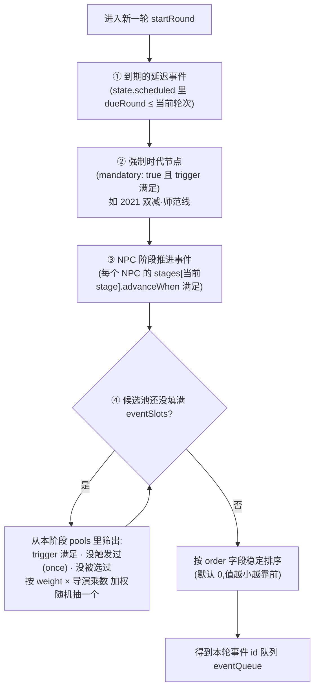
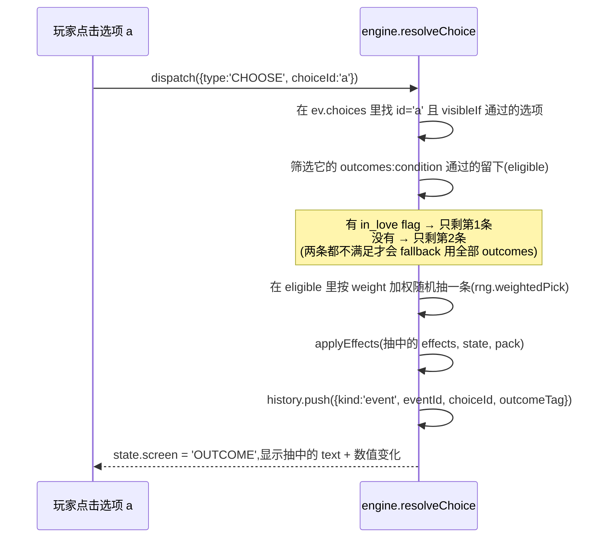
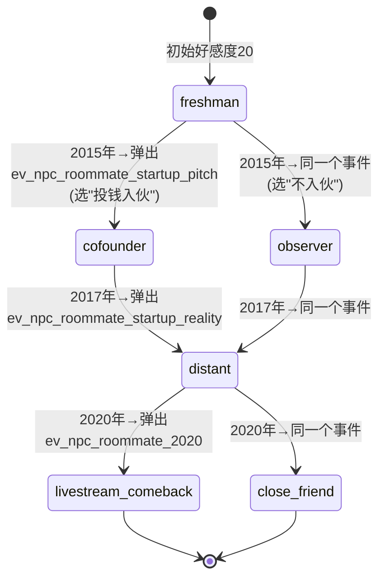
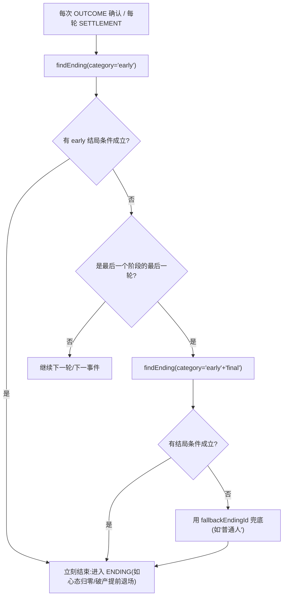

# 《2014:我的十二年》技术架构文档 v1.0

> 配套文档:[GAME_DESIGN.md](./GAME_DESIGN.md)(玩法设计)
> 2026-07-03 定稿,目标:支撑长期内容扩展(年份/事件/NPC/职业线)与多平台移植(Web → 微信小程序)。
> 2026-07-05 更新:三、四两节已按当前代码(`packages/core`)重新核对并补充 mermaid 图解,修正了与 v1.0 设计稿不一致的地方(详见各节内联说明)。

---

## 一、设计原则

四条原则,对应你提出的四类扩展需求:

| 原则 | 解决的问题 |
|---|---|
| **P1 内容即数据** | 加事件/NPC/结局 = 新增数据文件,不改引擎代码 |
| **P2 引擎纯函数、零平台依赖** | 移植小程序时引擎和内容 100% 复用,只重写 UI 壳 |
| **P3 时间线配置化** | 把游戏延长到 2030 = 追加配置和事件,引擎里没有写死的 "2026" |
| **P4 一切可校验、可模拟** | 内容多了以后靠工具保平衡:静态校验防死链,批量模拟防数值失控 |

反面教材(来自对 vc-simulator 的逆向):它把 528KB 的逻辑+内容+UI 打成一个不可维护的整体,结局条件写成裸函数导致出现 4 个 `() => false` 的死代码结局且无法被工具检测,也没有存档。本架构逐条规避。

---

## 二、总体架构

```
┌─────────────────────────────────────────────────────┐
│  平台层(每个平台一个薄壳)                            │
│  packages/web (React+Vite)   apps/miniprogram (Taro) │
│  只做:渲染 ViewModel、采集输入、平台服务(存储/分享) │
├─────────────────────────────────────────────────────┤
│  引擎层 packages/core(纯 TypeScript,零运行时依赖)  │
│  状态机 · 回合调度 · 事件抽取 · 数值结算 ·           │
│  NPC 状态机 · 结局判定 · 种子RNG · 存档/迁移         │
├─────────────────────────────────────────────────────┤
│  内容层 packages/content(纯数据 + 少量注册函数)     │
│  时间线 · 事件池 · NPC · 职业线 · 结局 ·             │
│  高考题库 · 家境卡 · 文案                            │
└─────────────────────────────────────────────────────┘
        ▲ 依赖方向:平台层 → 引擎层 → 内容Schema
          (引擎不 import 具体内容,内容以 ContentPack 注入)
```



### 仓库结构(pnpm monorepo)

```
life-simulator-2014/
├── pnpm-workspace.yaml
├── packages/
│   ├── core/                  # @life-sim/core 引擎(禁止 import react/dom/wx)
│   │   └── src/
│   │       ├── types/         # 全部 Schema 类型(内容层的"接口合同")
│   │       ├── engine/        # createEngine: start/view/dispatch
│   │       ├── systems/       # eventScheduler / npc / ending / stats / invest
│   │       ├── dsl/           # 条件与效果 DSL 的求值器
│   │       ├── rng/           # mulberry32 种子随机
│   │       └── save/          # SaveFile 序列化 + 迁移链
│   ├── content/               # @life-sim/content 内容包
│   │   └── src/
│   │       ├── timeline/      # phases.ts(时间线配置)
│   │       ├── events/        # 按池分文件:setup/ college/ career-cs/ career-edu/ npc/ invest/ random/
│   │       ├── npcs/          # 每个 NPC 一个文件
│   │       ├── careers/
│   │       ├── endings/
│   │       ├── exam/          # 题库(按省份档/文理标注)
│   │       ├── setup/         # 家境卡 backgrounds.ts · 特质卡 traits.ts · 志愿批次 applications.ts
│   │       └── fns/           # 命名自定义函数注册表(DSL 的逃生舱)
│   ├── web/                   # @life-sim/web React 前端
│   │   └── src/
│   │       ├── screens/       # 每种 ViewModel 一个 Screen 组件
│   │       ├── components/
│   │       └── platform/      # WebStorageAdapter / WebShareService
│   └── tools/                 # @life-sim/tools 校验与模拟 CLI
│       └── src/
│           ├── validate.ts    # 静态校验
│           └── simulate.ts    # 批量自动对局
└── apps/
    └── miniprogram/           # (未来)Taro 小程序,复用 core+content
```

---

## 三、引擎层设计

> 本节 2026-07-05 按当前代码(`packages/core/src`)重新核对过一遍,修正了与最初 v1.0 设计不一致的地方。如果你是被 `drama.ts` 里的 TS 绕晕了来看这一节,建议先看 3.0。

### 3.0 给不熟悉 TS 的读者:先认 5 个符号

后面的 Schema 代码反复用这几种写法,先认脸,不用记语法细节:

| 写法 | 怎么读 | 例子 | 意思 |
|---|---|---|---|
| `interface X { a: T }` | "X 长这样" | `interface NpcState { favor: number }` | 一个 X 类型的值,必须有字段 `a`,类型是 `T` |
| `a?: T` | "a 可以不写" | `weight?: number` | 可选字段,不写就相当于没有 |
| `A \| B` | "A 或 B" | `'文' \| '理'` | 值只能是这两种之一 |
| `T[]` | "一堆 T" | `GameEvent[]` | T 的数组 |
| `Record<string, T>` | "字符串做 key 的字典" | `Record<string, NpcState>` | 类似 `{ roommate: {...}, mentor: {...} }` |

**判别联合(discriminated union)是最值得先弄懂的写法**,因为 `Condition`、`Effect`、`ViewModel` 全是这么定义的:一个类型不是"把所有字段填满",而是"只长成列出的其中一种形状"。比如:

```ts
type Condition =
  | { flag: string; equals?: ... }
  | { year: { from?: number; to?: number } }
  | { all: Condition[] }
  | ...;
```

`{ flag: 'in_love' }` 是这个类型合法的一个值,`{ year: { from: 2020 } }` 也是——但不会同时看到 `flag` 和 `year` 出现在同一个对象里。引擎靠 `if ('flag' in cond)` 这种"看这个对象有没有某个字段"的写法来判断"现在拿到的是哪一种"(`dsl/evaluate.ts:22-69` 整个函数都在做这件事)。**以后在事件文件里看到一坨 `{ xxx: ... }`,第一步永远是:去 `Condition` 或 `Effect` 的定义里找它长得像哪一种,再查那一种的字段含义。**

### 3.1 三个函数就是整个引擎(`packages/core/src/engine/engine.ts`)

```ts
interface Engine {
  start(seed?: number): GameState;                              // 开一局新游戏,seed 不传就随机生成
  view(state: GameState): ViewModel;                             // 这个状态现在该画成什么画面
  dispatch(state: GameState, action: PlayerAction): GameState;   // 玩家的操作 + 旧状态 → 新状态
}
```

`dispatch` 内部先把 `state` 整个复制一份(`clone()`,直接 `JSON.parse(JSON.stringify(state))`),所有修改都发生在这份拷贝上,原状态不会被动——调用方(React 组件、`simulate` CLI、以后的小程序 UI)可以放心拿新旧两个状态对比、存档、回放。

`view()` 是一个大 `switch(state.screen)`,`state.screen` 是"当前在哪一页"的指针,取值是(`types/state.ts:3-15`):

```ts
type ScreenId =
  | 'TITLE' | 'BACKGROUND_DRAW' | 'SETUP' | 'EXAM' | 'EXAM_RESULT'
  | 'APPLICATION' | 'NPC_SELECTION' | 'LIFE_GOAL' | 'CROSSROAD' | 'BRIEF' | 'EVENT' | 'OUTCOME'
  | 'SETTLEMENT' | 'ENDING';
```

一局游戏,本质上就是这个指针不断跳转。拆成两张图更容易看清——因为"一次性流程"和"每轮重复的循环"节奏完全不同。

**第一张:开局的一次性流程(`flow` 类型阶段,只走一遍)**

```mermaid
flowchart LR
    TITLE -->|START| BACKGROUND_DRAW
    BACKGROUND_DRAW -->|CHOOSE_TRAITS 抽4选2并应用 statMods| SETUP
    SETUP -->|CHOOSE_SETUP 选性别+文理| EXAM
    EXAM -->|答完/SKIP_EXAM| EXAM_RESULT
    EXAM_RESULT -->|CONTINUE| APPLICATION
    APPLICATION -->|APPLY 报志愿| O1(OUTCOME)
    O1 -->|CHOOSE_NPCS 初恋必出+其余4选1| NPC_SELECTION
    NPC_SELECTION -->|进入大学第1轮| BRIEF1(BRIEF)
```



**第二张:每一轮重复的循环(`rounds` 类型阶段,大学 4 轮 / 社会 9 轮都走这个循环)**



`CROSSROAD`(大四三岔口)本身是第三个、只有一步的 `flow` 阶段,跟第一张图长得一样:`CROSSROAD --CHOOSE_CROSSROAD--> OUTCOME --进入社会第1轮--> BRIEF`,不再单独画图。

两张图里最容易让人困惑的是 **`OUTCOME` 是个十字路口**:同一个"确认"按钮(`CONTINUE`),会跳到 `EVENT`、`BRIEF` 还是 `SETTLEMENT`,取决于 `state.pendingFlowAdvance` 这个布尔开关(`engine.ts:551-595` 的 `continueAfterOutcome`)——报志愿、选三岔口这类"一次性流程步骤"会把它设成 `true`,表示"这一步是阶段推进,不是普通事件",引擎就知道接下来该进入下一个阶段(第一张图的路径)而不是继续弹事件(第二张图的路径)。

### 3.2 GameState:唯一的状态树(`packages/core/src/types/state.ts`)

```ts
interface GameState {
  schemaVersion: 1;
  seed: number;                  // 开局种子
  rngState: number;              // RNG 当前内部状态,决定"下一次随机"会摇出什么
  screen: ScreenId;              // 见上,当前该画哪一页
  phaseIndex: number;            // 当前处于 timeline 里第几个阶段(高考季/大学/三岔口/社会…)
  flowStepIndex: number;         // 阶段是 "flow" 类型时,当前走到第几个流程步骤
  roundIndex: number;            // 阶段是 "rounds" 类型时,当前是第几轮(第几学年/第几年)
  roundCounter: number;          // 全局累计轮数,不随阶段重置,给 schedule(延迟事件)当时间戳用
  date: { year: number; month: number };
  currentBrief: string | null;   // 本轮的"时代背景简报"文案
  eventQueue: string[];          // 本轮要依次弹出的事件 id 队列
  eventCursor: number;           // 队列走到第几个了
  pendingOutcome: { text: string; deltas: StatDeltas } | null;  // OUTCOME 页要显示的文案+数值变化
  pendingFlowAdvance: boolean;   // 见上,OUTCOME 十字路口的开关
  forcedEndingId: string | null; // 被某个 effect(triggerEnding)强制指定的结局
  pendingJumpPhaseId: string | null; // 被某个 effect(jumpToPhase)指定要跳去的阶段(如"复读"跳回高考)
  examPaper: string[]; examCursor: number; examCorrect: number; examEarnedPoints: number; // 高考答题过程
  traitOffer?: string[];          // BACKGROUND_DRAW 屏的特质候选 id,玩家 CHOOSE_TRAITS 后清空
  stats: Stats;                  // { knowledge, money, mindset, network, health }
  profile: Profile;              // 家境/省份/文理/分数/大学/专业/职业
  flags: Record<string, boolean | number | string>;  // 万能扩展槽,见下
  npcs: Record<string, { favor: number; stage: string }>;  // 每个 NPC 的好感度+剧情阶段
  pendingNpcEvents?: { npcId: string; eventId: string }[]; // 同年撞车后顺延的 NPC 阶段事件
  scheduled: { eventId: string; dueRound: number }[];  // 延迟事件队列(事件链)
  triggeredEventIds: string[];   // 已经触发过的事件 id(配合 once 去重)
  history: HistoryEntry[];       // 全部已发生的事件/志愿/三岔口记录,结局判定和 historyCount 条件都读它
  endingId: string | null;
}
```

**`flags` 是整个内容系统的万能扩展槽**:任何新机制,不管是"是否在恋爱中"(`in_love`)、"是否被裁员"(`laid_off`)、"大学录取批次"(`university_tier`),都先塞进这个字典里,不需要现在就在 `GameState` 上加新字段。`drama.ts` 里几乎每个 `condition`/`trigger` 最终都在读这个字典。

### 3.3 时间线:阶段配置驱动主循环(`packages/content/src/timeline/phases.ts`)

引擎的主循环完全不知道"大学四年""2026 年结束"这些具体概念,只认两种阶段形状(`types/content.ts:61-79`):

```ts
type PhaseConfig =
  | { kind: 'flow'; id: string; label: string; date: GameDate;
      steps: ('BACKGROUND_DRAW'|'SETUP'|'EXAM'|'APPLICATION'|'NPC_SELECTION'|'LIFE_GOAL'|'CROSSROAD')[] }
  | { kind: 'rounds'; id: string; label: string; date: GameDate;
      rounds: number; eventSlots: number; pools: string[]; briefs: string[]; isFinal?: boolean };
```

真实配置长这样(`phases.ts` 节选):

```ts
export const phases: PhaseConfig[] = [
  { kind: 'flow', id: 'gaokao', label: '高考季', date: { year: 2014, month: 6 },
    steps: ['BACKGROUND_DRAW', 'SETUP', 'EXAM', 'APPLICATION', 'NPC_SELECTION'] },
  { kind: 'rounds', id: 'college', label: '大学时代', date: { year: 2014, month: 9 },
    rounds: 4, eventSlots: 3, pools: ['college', 'npc', 'invest', 'random'], briefs: [/* 4条 */] },
  { kind: 'flow', id: 'crossroad', label: '大四三岔口', date: { year: 2018, month: 3 },
    steps: ['LIFE_GOAL', 'CROSSROAD'] },
  { kind: 'rounds', id: 'work', label: '社会十年', date: { year: 2018, month: 7 },
    rounds: 9, eventSlots: 3, pools: ['work', 'invest', 'random'], briefs: [/* 9条 */], isFinal: true },
];
```

**想把游戏延长到 2030**:把 `work` 阶段的 `rounds` 从 9 改成 13、补 4 条 `briefs`,`isFinal` 保持在最后一个阶段;引擎代码零改动——这是"内容即数据"原则在时间线上的体现。

### 3.4 每一轮怎么选出要弹的事件(`packages/core/src/systems/scheduler.ts`)

`rounds` 类型的阶段每进一轮(`startRound`),都会调用 `pickRoundEvents` 决定这一轮弹哪几个事件,按固定优先级填满 `eventSlots`:



①②③ **不占用 `eventSlots` 的名额,是额外保证入队**的——如果强制时代节点或 NPC 剧情节点被 `eventSlots` 挤掉,会导致强制剧情永久卡死或漏掉,所以代码里专门把这两类和"常规随机池填充"分开处理。只有第④步"常规池"才受 `eventSlots` 限制。

**导演式选择器(M5 第三十轮,只作用于第④步)**:随机池抽取的实际权重是 `(ev.weight ?? 1) × directorMultiplier(...)`,导演乘数由四部分连乘:

| 系数 | 条件 | 乘数 |
|---|---|---|
| 同年类别去重 | 本轮已排入同 `category` 事件 | ×0.35 |
| 近两年类别冷却 | `state.history` 里近两年该 category 命中 ≥2 次 | ×0.6 |
| 心态节奏(低谷给喘息) | `mindset ≤ 35` 且事件情绪期望 >0.5 / <-0.5 | ×1.8 / ×0.55 |
| 心态节奏(顺风上压力) | `mindset ≥ 75` 且情绪期望 <-0.5 / >0.5 | ×1.5 / ×0.75 |
| 特质/成长/目标偏好 | 玩家特质、成年成长路线、人生目标的 `poolBias[category]` | 按配置连乘 |

事件的"情绪期望"由 `eventMindsetValence(ev)`(同文件导出,WeakMap 缓存)自动推导:对每个选项按 outcome 权重求名义 mindset 变化的加权平均,再对所有选项取平均——**不需要给事件人工打情绪标签**。最终乘数钳位在 `[0.15, 4]`,保证没有事件被压成 0 权重,`simulate -n 10000 --check` 的全事件覆盖/全结局可达门禁不受威胁。导演不碰 ①②③(强制/NPC/schedule 事件),因果链的确定性不变。

### 3.5 玩家选一个选项之后发生了什么(`resolveChoice`,`engine.ts:525-549`)

用你正在看的 `drama.ts` 里 `ev_drama_pig_butchering`(屏幕那头的人)这个真实事件走一遍。它的选项 `a`(投两千试试)配置了两条互斥的 `outcomes`:

```ts
{
  id: 'a',
  text: '投两千试试，能提现就是真的',
  outcomes: [
    { weight: 1, condition: { flag: 'in_love' },          text: '……另一半已经在门口站了很久。', effects: [...] },
    { weight: 1, condition: { not: { flag: 'in_love' } }, text: '……你不是在钓鱼，你是鱼。',       effects: [...] },
  ],
}
```

对应的结算流程:



**这就是为什么同一份代码看起来选项很少,但实际体验千变万化**:每个选项背后可能挂 1~3 条按 `condition` 互斥、按 `weight` 加权的 outcome,`flag`(如 `in_love`)、`stat`(如学识/心态)、`chance`(纯概率)都可以拿来当筛选条件。

### 3.6 NPC 是一台独立的状态机,不是"事件"

每个 NPC(`packages/content/src/npcs/npcs.ts`)不写具体剧情,只维护"现在在哪个阶段"+"好感度",阶段之间的跳转条件和跳转时触发的剧情事件是配置出来的:

```ts
interface NpcDef {
  id: string; name: string;
  initialStage: string; initialFavor: number;
  stages: Record<string, { advanceWhen?: Condition; eventId?: string }>;
}
```

以"创业室友"(`roommate`)为例,真实配置画成状态机是这样:



玩家进入 `NPC_SELECTION` 时,引擎固定初始化初恋状态机,并从其余 4 人中接收 1 位玩家选择后初始化对应状态机。调度器每轮检查当前 stage 的 `advanceWhen`;每轮最多播放 1 个 NPC 节点,同年其余候选写入 `pendingNpcEvents` 顺延,下一轮即使越过原年份窗口也会继续播放,但会先核验 NPC 仍处于对应 stage。玩家在事件里通过 `npcStage` effect 决定下一阶段。

### 3.7 结局怎么判定(`packages/core/src/systems/ending.ts`)

```ts
function findEnding(state, pack, rng, categories) {
  const sorted = pack.endings
    .filter(e => categories.includes(e.category))   // 'early' 或 'final'
    .sort((a, b) => a.priority - b.priority);         // priority 越小越优先
  for (const ending of sorted) {
    if (evalCondition(ending.condition, ctx)) return ending;  // 第一个满足条件的胜出
  }
  return null;
}
```



**关键设计**:`early` 结局在游戏进行中随时可能触发(每次选完选项都检查一次),`final` 结局只在 2026 年最后一轮结算时参与排序;`priority` 决定"如果同时满足好几个结局,听谁的"——新加结局时要想清楚它和已有结局的 priority 相对位置,否则可能被更靠前的结局"截胡",永远摸不到。这也是为什么 `pnpm simulate` 要跑大样本:光看 condition 写得对不对,看不出它会不会被别的结局挡住。

---

## 四、内容数据模型(Schema)

### 4.1 条件/效果 DSL(内容可校验性的关键)

**不用裸函数写条件**(vc-simulator 的教训:函数无法被工具分析,死条件无法检测),用可序列化的声明式 DSL(`packages/core/src/types/dsl.ts`,已按当前代码核对):

```ts
type Op = '>' | '>=' | '<' | '<=' | '==';

type Condition =
  | { always: true }
  | { stat: 'knowledge'|'money'|'mindset'|'network'|'health'; op: Op; value: number }
  | { flag: string; equals?: boolean|number|string }        // 不写 equals 就是"只要这个 flag 是 truthy"
  | { year: { from?: number; to?: number } }
  | { career: string } | { background: string } | { major: string }
  | { npcFavor: string; op: Op; value: number } | { npcStage: string; stage: string }
  | { historyCount: { category?: string; outcomeTag?: string; op: Op; value: number } }  // "过去发生过≥3次某类事件"
  | { chance: number }                                   // 概率门,不看状态,纯掷骰子
  | { all: Condition[] } | { any: Condition[] } | { not: Condition }
  | { fn: string };   // 逃生舱:引用 content 里 fns 注册表的命名函数(<10% 的复杂场景才用)

type Effect =
  | { stats: Partial<Record<'knowledge'|'money'|'mindset'|'network'|'health', number>> }  // 数值增减,引擎负责 clamp
  | { moneyCost: { rate: number; min?: number; max?: number; roundTo?: number;
                   reason?: 'daily'|'medical'|'family'|'investment'|'scam'|'house'|'other' } }  // 详见 4.1.1
  | { setStat: 'knowledge'|'money'|'mindset'|'network'|'health'; value: number }
  | { setFlag: string; value?: boolean|number|string }
  | { npcFavor: string; delta: number } | { npcStage: string; stage: string }
  | { schedule: { eventId: string; afterRounds: number } }   // 事件链:N 轮后触发后续事件
  | { setCareer: string } | { jumpToPhase: string }          // 复读→跳回高考阶段;考研→跳到不同时间线
  | { triggerEnding: string }                                // 强制指定结局(下一次 OUTCOME 确认时生效)
  | { fn: string; args?: Record<string, unknown> };
```

`fn` 注册表让 DSL 覆盖不了的逻辑仍有出口,但强制**具名、集中、可测试**,不会散落在数据里。

**拿 `drama.ts` 里真实的一行代码练手**:文件顶部定义了一个复用的条件常量 `working`,专门判断"当前是不是已经在上班"——

```ts
const working: Condition = {
  all: [
    { any: [{ flag: 'entered_job_market_2018' }, { flag: 'postgrad_done' },
             { flag: 'career_gov' }, { flag: 'civil_service_failed' }] },
    { any: [{ not: { flag: 'laid_off' } }, { flag: 'restarted_after_layoff' } ] },
  ],
};
```

拆解读法:最外层是 `all`(数组里每一条都要成立,相当于"且");里面两个 `any`(数组里任意一条成立即可,相当于"或")。翻译成人话就是:**"(求职成功 或 读研毕业 或 进了体制内 或 考公落榜后转求职) 且 (没被裁员 或 被裁后又重新上岸了)"**。这个常量之后在好几个事件的 `trigger` 里被直接引用,比如 `ev_drama_pig_butchering` 的 `trigger: { all: [{ year: { from: 2020, to: 2023 } }, working] }` 读作:"年份在 2020-2023 之间,并且这个人正在上班"。

### 4.1.1 金钱扣减 DSL 设计(防固定金额超扣)

问题背景:

- 事件里直接写 `stats: { money: -300000 }` 会在余额不足时被引擎钳到 0,但内容配置表达的是一个玩家实际上付不起的数字。
- 固定扣款对不同家境、职业、投资结果的玩家压力差异过大:穷玩家直接归零,富玩家无感。
- 当前 `money` 同时承担现金、净资产、结局判定资产三种含义,因此大额支出必须显式区分"消费损失"和"资产置换"。

设计新增一个声明式金钱效果,专门处理负向扣减:

```ts
type MoneyCostEffect = {
  moneyCost: {
    /** 按当前 money 的比例扣减,0.25 表示扣 25% */
    rate: number;
    /** 可选:理论扣减下限。实际扣减仍不能超过当前余额 */
    min?: number;
    /** 可选:理论扣减上限 */
    max?: number;
    /** 可选:四舍五入到 100 / 1000 等,避免出现碎金额 */
    roundTo?: number;
    /** 可选:用于工具报表和内容审计 */
    reason?: 'daily' | 'medical' | 'family' | 'investment' | 'scam' | 'house' | 'other';
  };
};
```

引擎计算:

```ts
const raw = state.stats.money * rate;
const bounded = clamp(raw, min ?? 0, max ?? Infinity);
const rounded = roundTo ? Math.round(bounded / roundTo) * roundTo : Math.round(bounded);
const actual = Math.min(state.stats.money, rounded);
state.stats.money -= actual;
deltas.money -= actual;
```

关键约束:

- `actual` 永远不大于当前余额,不会出现"扣减金额大于余额"。
- OUTCOME 页面显示 `actual`,不是配置里的理论值。
- `moneyCost` 只表达负向扣减;工资、奖金、投资收益等正向来源继续使用固定 `stats.money`。
- 如果余额为 0,`moneyCost` 的金钱变化为 0,但同一 outcome 仍可通过心态、健康、人脉等效果表达代价。

资产置换规则:

```ts
type SetStatEffect = { setStat: 'money'; value: 0 };
```

- 买房、全仓投资等"现金换资产"事件不使用大额固定扣减。当前买房使用 `moneyCost` 扣当前余额 50%,再通过 schedule 事件把资产净值折算回 `money`,例如早买房补回高估值,晚买房补回较低估值。
- `setStat` 仍保留给需要精确设置数值的特殊事件,但不是当前买房扣款的主路径。
- 在未来拆分 `cash / assets / debt` 之前,这是一种保持单一 `money` 指标可用的过渡方案。

内容迁移状态:

1. 引擎已实现 `moneyCost` 效果,并保留已有 `setStat`。
2. `validate` 已增加门禁:事件 outcome 中出现 `stats.money < -10000` 会报 error,要求改用 `moneyCost`。万元以内的小额固定支出暂时允许。
3. 已将现有大额固定负扣款迁移到 `moneyCost`;后续新增/调整事件继续按以下口径配置:
   - 日常消费:3%–8%,max 3000–8000
   - 中等消费/预付费:10%–25%,max 20000–50000
   - 投资亏损/诈骗:30%–70%,按风险程度设 max
   - all-in/买房:80%–100%,或 `setStat money=0 + schedule 资产回补`
4. 跑 `pnpm simulate -n 1000 --check` 和四策略 compare,观察金钱分位、提前结局、兜底结局是否偏移。
5. 如果未来需要彻底禁止所有固定负扣款,再把万元以内小额支出的豁免收紧为显式字段或白名单。

### 4.2 事件 Schema(`packages/core/src/types/content.ts`)

```ts
interface GameEvent {
  id: string;                   // 'ev_drama_pig_butchering'
  pools: string[];              // 属于哪些池:'college' | 'work' | 'npc' | 'invest' | 'random' | ...
  title: string;
  text: string;                 // 纯静态中文文案,没有插值机制,想带数值就得在文案里手写
  category?: string;            // 'money' | 'relationship' | 'career' | ... ,只给结局的 historyCount 统计用
  trigger?: Condition;          // 这个事件本轮"有没有资格"被抽到
  weight?: number;              // 默认 1,常规池加权抽取时用;是个死数字,不会根据状态动态变化
  once?: boolean;               // 默认 true(只能触发一次);显式设 false 才能重复触发
  mandatory?: boolean;          // 强制时代节点,不受 eventSlots 限制,trigger 满足就必进队
  order?: number;               // 同轮内的排序,默认 0,数值越小越靠前(如"毕业散伙饭"排最后)
  tier?: 'major';               // 打上这个标记的事件文案更长,UI 会显示"关键节点"标识
  choices: Array<{
    id: string;
    text: string;
    visibleIf?: Condition;      // 隐藏选项(如人脉>60 才出现"找内推")
    outcomes: Array<{           // 一个选择可以有多个互斥/加权的结果
      weight: number;
      condition?: Condition;    // 满足才进入候选;全都不满足时 fallback 用全部 outcomes(见 3.5)
      text: string;
      outcomeTag?: string;      // 'success'|'failure' 这类标签,给结局的 historyCount 统计用
      effects: Effect[];
    }>;
  }>;
}
```

**加一个事件** = 在对应池文件里追加一个对象,跑一遍 `pnpm validate`,完毕。

### 4.3 NPC Schema(状态机)

```ts
interface NpcDef {
  id: string;                   // 'roommate'
  name: string;                 // '创业室友'
  initialStage: string;
  initialFavor: number;
  stages: Record<string, {
    advanceWhen?: Condition;    // 满足即推进到这个阶段(通常是"年份到了"),不写就是"终局阶段,不再推进"
    eventId?: string;           // 到达该阶段时触发的剧情事件
  }>;
}
```

**加一个 NPC** = 一个 `NpcDef`(放进 `npcs.ts`) + 它引用的剧情事件(放进 `npc` 池)。引擎的 NPC 系统是通用的,不认识任何具体角色,3.6 有 `roommate` 的完整状态机图。

### 4.4 结局 Schema

```ts
interface EndingDef {
  id: string;
  title: string;                // '小镇做题家的胜利'
  text: string;
  category: 'early' | 'final';  // 提前结局(随时检查) / 终局结算(仅最后一轮参与排序)
  priority: number;             // 越小越优先,同一轮里可能好几个结局同时满足,只有 priority 最小的会被选中
  condition: Condition;         // 声明式 → simulate 工具能统计每个结局的实际到达率
  shareCard?: { tone: 'triumph'|'bitter'|'warm'; tagline: string };  // 不写就用通用兜底文案
}
```

### 4.5 ContentPack(内容注入引擎的唯一通道)

```ts
interface ContentPack {
  meta: { id: string; version: string; title: string;
          fallbackEndingId: string; examQuestionCount: number; scoring?: ScoringConfig };
  timeline: PhaseConfig[];
  events: GameEvent[];
  incomes: IncomeRule[];        // 见 4.6,职业线的年度被动收入
  endings: EndingDef[];
  examBank: ExamQuestion[];
  backgrounds: BackgroundCard[];// 家境抽卡
  traits: TraitCard[];          // 玩家特质卡(开局抽4选2,见 4.7)
  applications: ApplicationOption[];  // 志愿批次(985/211/一本/…)
  npcs: NpcDef[];
  fns: Record<string, ContentFn>;
}
const engine = createEngine(contentPack);   // 引擎实例化时注入
```

> 和 v1.0 设计稿的差异:当前**没有** `careers: CareerDef[]` 这个字段——职业线不是一个独立的数据结构,而是靠 `flags`(`career_cs`/`first_job_track` 之类)+ 对应的 `career-xx` 事件池 + `incomes.ts` 里按 flag 匹配的收入规则拼出来的。早期的 `provinces: ProvinceOption[]`(省份分数线加减)已在 M5 第二十九轮整体移除。`mergePacks` 多 DLC 合并目前也**尚未实现**,现在是单一 `ContentPack`(见 `packages/content/src/index.ts`)。

### 4.6 年度被动收入 IncomeRule(`packages/content/src/economy/incomes.ts`)

工资/生活费不是靠事件选项手动加的,而是每年结算时(`settleRound` → `applyAnnualIncome`,`engine.ts:339-351`)统一按规则结算一遍:

```ts
interface IncomeRule {
  id: string; label: string;
  when: Condition;         // 满足才生效,通常按 career_xx flag 匹配职业线
  amount: number;          // 年度净储蓄(元/年),可以是负数(比如失业期消耗存款)
  mindsetDelta?: number;   // 这份工作对心态的年度损耗/恢复
  healthDelta?: number;    // 这份工作对健康的年度损耗/恢复
}
```

真实例子:

```ts
{ id: 'inc_cs_big_platform', label: '大厂工资',
  when: { all: [{ flag: 'career_cs' }, { flag: 'big_platform_start' }, employed] },
  amount: 62000, mindsetDelta: -6, healthDelta: -5 },
{ id: 'inc_unemployed_gap', label: '空窗期消耗',
  when: { all: [{ flag: 'laid_off' }, { not: { flag: 'restarted_after_layoff' } }] },
  amount: -50000, mindsetDelta: -10 },
```

每年结算时,**所有** `when` 成立的规则都会生效(不是只选一条),所以"大厂工资"和"空窗期消耗"分别对应两种互斥的 flag 组合,同一年不会同时触发。这是"职业线"在数值上的真正落地方式——事件文案负责剧情起伏,`incomes.ts` 负责每年稳定的现金流。

### 4.7 玩家特质 TraitCard(`packages/content/src/setup/traits.ts`,M5 第三十轮)

```ts
interface TraitCard {
  id: string;      // 必须 trait_ 前缀(validate 强制),如 trait_risk_taker
  label: string;   // 展示名:天生胆大
  text: string;    // 抽卡屏上的一句话人设
  poolBias?: Record<string, number>;  // 导演选择器的类别偏好:{ invest: 1.8, money: 1.3 }
  statMods?: Partial<Record<StatKey, number>>; // 开局选择后立即应用的小幅数值修正
}
```

运行机制:

- **抽 4 选 2**:开局 `BACKGROUND_DRAW` 流程步里 `rng.sample(pack.traits, 4)` 写入 `state.traitOffer`;此时还不写 `flags`。玩家提交 `{ type:'CHOOSE_TRAITS', traitIds }` 后,引擎校验数量、去重和候选合法性,再写 `state.flags[trait.id] = true`、应用 `statMods`、清空 `traitOffer` 并进入 SETUP。miniPack/测试包特质少于 4 时候选数为 `min(4, traits.length)`,选择数仍按实际候选钳到最多 2。
- **展示**:`BACKGROUND_DRAW` ViewModel 透出 `{ card, traitOffer: TraitCard[], pickCount }`,三端抽卡屏渲染可选卡;StatsBar/小程序/小游戏顶栏从 flags 反查已选特质常驻展示。
- **影响事件分布**:`poolBias` 被调度器读取(见 3.4),按 category 调整随机池抽取概率。
- **成年分化**:2023 年 mandatory 事件从已选两项特质衍生出 4 个可见选项,玩家选 1 条 `trait_growth_*` 路线;`TraitEvolution.poolBias` 继续参与导演权重,成长标签同步显示在顶栏与分享结果。
- **影响开局数值**:`statMods` 在 CHOOSE_TRAITS 时立即应用;`knowledge/mindset/network/health` 钳到 0-100,`money` 只做非负钳位。当前 6 张卡有得有失,避免一眼最优。
- **影响事件内容**:内容用现成的 DSL 分支——选项 `visibleIf: { flag: 'trait_social' }` 做专属选项,outcome `condition` 做专属结果文案,无需任何新 DSL 能力;每个特质另有 1 个 `mandatory` 专属事件(`events/trait-moments.ts`,年份窗口 + trait flag 门控,带该特质的玩家该年必触发)。M5 第三十二轮后特质分支约 33 处。
- **影响终局表达**:6 个特质专属结局排在职业/叙事结局之后、兜底之前,只收原本会落入「平凡之路」的玩家;ENDING shareCard viewmodel 额外带 `traits: string[]`,web/小程序/小游戏分享文案与分享图同步展示。
- **UI 标签(M5 第三十一轮)**:`view()` 里 `requiredTraitLabel(cond)` 识别选项 `visibleIf` / 事件 `trigger` 中"必然要求某特质"的条件(顶层 flag 或 `all` 分支;`any` 里的备选不算),自动给文案加 `【特质名】` 前缀——特质内容的可感知性不靠内容作者手写,是引擎级保证。
- **校验**(`validate.ts`):特质 id 唯一且 `trait_` 前缀、label/text 非空、`poolBias` 值 ∈ (0,5] 且 category 必须真实存在于事件库;`statMods` key 必须是合法 StatKey,值域为非 0 且绝对值 ≤20;全内容里引用的 `trait_*` flag 必须在特质表中;内容禁止 `setFlag` 特质(特质只在开局选择赋值)。

设计约束(见 GAME_DESIGN 二-2):特质专属选项必须带真实变数,不得成为透明优势选项;新增特质时注意两个特质同 category 的 `poolBias` 会连乘,别把单类推过导演乘数上限 4。

---

## 五、存档与版本迁移

```ts
interface SaveFile {
  saveVersion: number;          // 存档结构版本
  contentVersion: string;       // 生成存档时的内容包版本
  createdAt: string;
  seed: number;
  actionLog: PlayerAction[];    // 完整操作日志
  snapshot: GameState;          // 当前状态快照
}
```

**双保险策略**:
- 正常读档用 `snapshot`(快)。
- 内容/引擎升级导致 snapshot 不兼容时,回退到 **seed + actionLog 重放**(引擎纯函数 + RNG 可复现,重放结果确定)。重放同时是最强的回归测试。
- `save/migrations.ts` 维护迁移链:`v1→v2→v3` 逐级升级旧档。

存储通过适配器接口,引擎不知道 localStorage 的存在:

```ts
interface StorageAdapter {
  get(key: string): Promise<string | null>;
  set(key: string, value: string): Promise<void>;
  remove(key: string): Promise<void>;
}
// web:localStorage 包一层;小程序:wx.getStorage / wx.setStorage
```

---

## 六、平台适配(Web 现在,小程序未来)

### 6.1 Web(首发)

React 18 + Vite + TypeScript + Zustand(仅做 UI 状态壳,真状态在 GameState)。
`screens/` 下每种 ViewModel.kind 一个组件;动画用 CSS transition(刻意不引入 framer-motion,见 6.2)。
静态部署 Vercel / Cloudflare Pages。

### 6.2 微信小程序(预留的移植路径)

**方案:Taro 4(React 语法编译到小程序)**,复用比例预估:

| 层 | 复用度 | 说明 |
|---|---|---|
| core 引擎 | **100%** | 纯 TS,直接 npm 引用 |
| content 内容 | **100%** | 纯数据 |
| screens UI | ~60% | Taro 用 React 语法,但组件要换成 View/Text,样式要适配 rpx |
| platform 服务 | 0%(本来就是每平台一份) | WxStorageAdapter、wx.shareAppMessage 分享卡 |

**从现在起就要遵守的小程序约束**(这是把移植成本从"重写"降到"适配"的关键):
1. core/content 不 import 任何浏览器 API(`window`/`document`/`localStorage` 全部禁止,ESLint 规则强制)
2. 不引入重动画/DOM 依赖库(framer-motion、任何操作 DOM 的库)
3. 小程序主包限 2MB:content 包设计上支持按阶段分包懒加载(事件池文件本来就按阶段切分,天然可分包)
4. 分享卡片渲染做成纯数据 → 绘制函数(web 用 DOM/Canvas,小程序用 canvas 2d,输入同一份 `ShareCardData`)

### 6.3 想给内容"加详细程度"时的路径

- 事件文案加长/加插图:`GameEvent` 预留 `image?: string` 字段,UI 有图渲染无图跳过
- 某个选择想要更细的分支:`outcomes` 数组本来就支持任意多条件结果
- 想加新数值维度(比如"健康"独立出来):`stats` 加字段 + 存档迁移 + validate 兜底,DSL 的 `stat` 类型自动覆盖

---

## 七、质量工具链(内容规模化的保险)

### 7.1 静态校验 `pnpm validate`

- Schema 校验(zod):字段类型、必填、数值范围
- 引用完整性:事件引用的 flag/npc/eventId/fn 必须存在;`schedule` 指向的事件必须存在
- ID 全局唯一;每个池至少 N 个事件(防止某阶段抽空)
- **结局可达性静态检查**:condition 恒假(如 `{chance: 0}`、互斥条件)直接报错——从根上杜绝 vc-simulator 的 `() => false` 死结局
- **特质校验**(M5 第三十/三十二轮):特质 id 唯一 + `trait_` 前缀、`poolBias` 取值范围与 category 真实性、`statMods` 键和值域;内容里引用的 `trait_*` flag 必须存在于特质表;禁止内容 `setFlag` 特质

### 7.2 批量模拟 `pnpm simulate -n 10000`

引擎纯函数 → 可以让随机 bot(以及"贪心 bot""摆烂 bot"等策略 bot)自动打一万局,输出:

- 结局分布(某结局 0 次到达 = 设计问题,>40% = 太容易)
- 数值曲线分位数(心态是不是普遍在第 8 回合就见底?)
- 事件覆盖率(哪些事件从没被抽到)
- 平均局长(回合数/预估游玩分钟数)

这是纯写死内容游戏做数值平衡的唯一低成本手段,列为**每次内容合并前的必跑项**。

### 7.3 测试

- 引擎单元测试(vitest):调度器、DSL 求值器、结局判定、RNG 复现性
- 黄金存档回归:固定 seed + actionLog,断言最终 GameState 快照不变(引擎重构的安全网)

---

## 八、扩展操作手册(Playbook)

| 我想…… | 要做的事 | 动到的层 |
|---|---|---|
| 加一个事件 | 对应池文件加一个 `GameEvent` → `validate` → `simulate` | 内容 |
| 加一个 NPC | 新 `NpcDef` + 其剧情事件池 | 内容 |
| 加一条职业线 | `setCareer`+`career_xx` flag + `career-xx` 事件池 + `incomes.ts` 收入规则 + 相关结局 | 内容 |
| 延长到 2030 | timeline 追加 phases + 新年份 era 事件 + 调整 `isFinal` | 内容 |
| 加结局 | `EndingDef` 一条,注意 priority 排位 → simulate 看到达率 | 内容 |
| 加一个特质 | `traits.ts` 加 `TraitCard`(含 poolBias/statMods) + 给若干事件挂 `visibleIf: {flag:'trait_xx'}` 专属选项 + 可选专属结局 → `validate` → `simulate` | 内容 |
| 调事件出现节奏 | 改 `scheduler.ts` 导演系数(类别冷却/心态阈值/钳位),跑 `simulate -n 10000 --check` 守覆盖 | 引擎 |
| 加数值维度 | `stats` 加字段 + 存档迁移 + DSL 自动支持 | 引擎(小改)+ 内容 |
| 移植小程序 | Taro 壳 + WxStorageAdapter + screens 适配 | 平台层(新增) |
| 出 DLC 剧情包 | 独立 ContentPack(`mergePacks` 尚未实现,目前只能单一 pack) | 内容 + 引擎(待补) |

---

## 九、技术选型清单

| 项 | 选择 | 理由 |
|---|---|---|
| 语言 | TypeScript(strict) | Schema 即类型,内容写错编译期报错 |
| 包管理 | pnpm workspace | 三包一仓,依赖方向清晰 |
| 前端 | React 18 + Vite | 生态成熟;Taro 同为 React 语法,移植心智成本最低 |
| UI 状态 | Zustand | 轻;真正的游戏状态在引擎 GameState |
| 校验 | zod | Schema 定义与运行时校验一份代码 |
| 测试 | vitest | 与 Vite 同生态 |
| RNG | mulberry32(自实现,~10 行) | 可种子化、可序列化(vc-simulator 同款,已验证) |
| 部署 | Vercel / Cloudflare Pages | 纯静态,零成本 |

**非目标(明确不做)**:后端/账号系统、运行时 LLM 调用、多语言、移动原生 App。

---

## 十、实施里程碑

| 里程碑 | 内容 | 验收标准 |
|---|---|---|
| M0 骨架 | monorepo + core 引擎跑通 + 最小内容包(3事件1结局)+ simulate CLI | 命令行能自动打完一局 |
| M1 开局 | 抽卡→省份/文理→答题→志愿 全流程 + web UI 壳 | 浏览器里能玩到"大学录取" |
| M2 大学 | 4 学年回合 + NPC 系统(室友/初恋)+ 三岔口 | 能玩到 2018 毕业 |
| M3 社会 | 年度回合 + 计算机/师范双职业线 + 投资线 | 能玩到 2026 |
| M4 终局 | 结局系统 + 分享卡片 + localStorage 存档 | 完整一局 + 可分享 |
| M5 打磨 | 内容填充至 ~125 事件 + simulate 驱动平衡 + 移动端适配 | 结局分布合理,可公开上线 |
